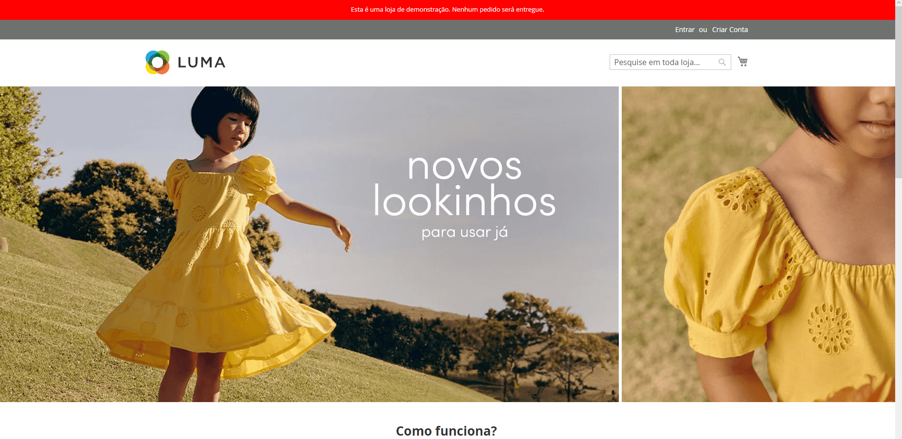
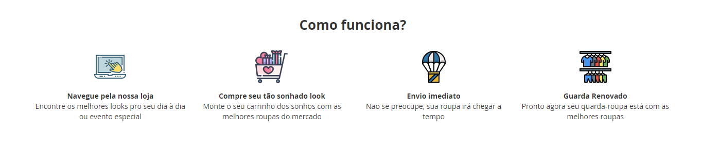
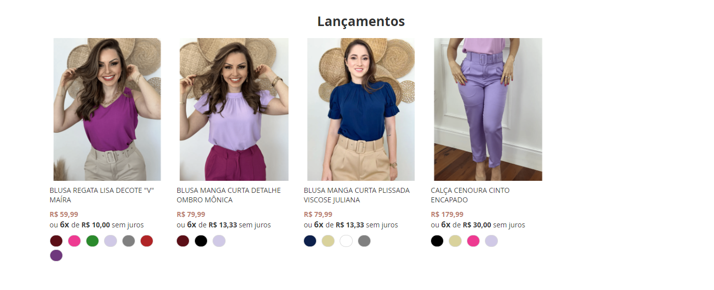
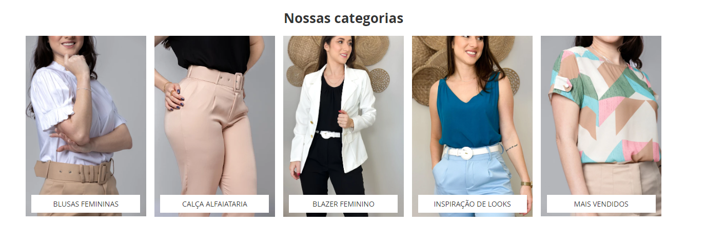

# Desafio de Desenvolvimento Frontend

## Criar e configurar o Ambiente

Para dar inicio a este desafio, foi necessário contratar uma droplet na DigitalOcean e "subir" um ambiente de desenvolvimento do zero.
O ambiente foi configurado com Apache, Mysql, Elasticsearch, Composer e Php 8.1 e então foi feito a instalação do Magento 2.4.5.
No magento foi apenas realizado algumas configurações iniciais para que o mesmo pudesse funcionar normalmente.

## Criando a homepage

### Slider Principal

Foi utilizado o modulo gratuito de slider da Mageplaza para montar o slider principal. As imagens e o slider são adicionados e criados no próprio menu da Mageplaza na barra lateral esquerda do painel admin.
Para inserir o slider na homepage de forma que ficasse fullwidth foi necessário fazer a chamada do slider em um bloco estático e por meio de widget adicionar o mesmo na homepage, na posição abaixo do header/menu.
Por uma limitação/bug do modulo de slider da mageplaza, foi necessário criar dois slider, um para o desktop e o outro para o mobile.

Obs: as imagens foram retiradas do site da <a href="https://www.lojasrenner.com.br/" target="_blank">Renner</a>.



### Seção Como funciona

Foi criado a estrutura html e feito os devidos ajustes por css para a visão desktop e mobile.

Obs: os icones foram baixados do site <a href="https://www.flaticon.com/br/" target="_blank">Flaticon</a>.

Código:

```

<!-- Block Como funciona -->
<div class="como-funciona">
    <h2 style="font-weight: bold;">Como funciona?</h2>

    <div class="etapas">
        <div class="etapa">
            

            <div class="texto">
                <strong>Navegue pela nossa loja</strong>
                <p>Encontre os melhores looks pro seu dia à dia ou evento especial</p>
            </div>
            
        </div>
    
        <div class="etapa">
            

            <div class="texto">
                <strong>Compre seu tão sonhado look</strong>
                <p>Monte o seu carrinho dos sonhos com as melhores roupas do mercado</p>
            </div>
    
        </div>
    
        <div class="etapa">
            

            <div class="texto">
                <strong>Envio imediato</strong>
                <p>Não se preocupe, sua roupa irá chegar a tempo</p>
            </div>
            
        </div>
    
        <div class="etapa">
            

            <div class="texto">
                <strong>Guarda Renovado</strong>
                <p>Pronto agora seu quarda-roupa está com as melhores roupas</p>
            </div>
            
        </div>
    </div>
</div>

```



### Área de vitrine dos produtos

Os produtos, opções de cor, layout e exemplo de parcelamento foram retirados/usados de inspiração da loja <a href="https://www.lojasimporium.com.br/" target="_blank">Imporium</a>

Obs: Tentei me aproximar o máximo possível do site que utilizei como referência. Foi necessário o uso do recurso nativo de lista de produtos do magento para exibir os produtos.

Código:

```

<div class="produtos">
    <h2 style="font-weight: bold; text-align: center;">Lançamentos</h2>
    {{widget type="Magento\CatalogWidget\Block\Product\ProductsList" title="" show_pager="1" products_per_page="4" products_count="16" template="Magento_CatalogWidget::product/widget/content/grid.phtml" conditions_encoded="^[`1`:^[`type`:`Magento||CatalogWidget||Model||Rule||Condition||Combine`,`aggregator`:`all`,`value`:`1`,`new_child`:``^],`1--1`:^[`type`:`Magento||CatalogWidget||Model||Rule||Condition||Product`,`attribute`:`category_ids`,`operator`:`==`,`value`:`2, 3`^]^]" page_var_name="pizefb"}}
</div>

```



### Seção de Banners com link

Assim como os produtos, as imagens para os banners e o estilo do botão foram retirados da loja <a href="https://www.lojasimporium.com.br/" target="_blank">Imporium</a>, porém foi necessário realizar algumas modificações para que ficasse perfeito no magento.

Obs: foi escrito no código um comentário mostrando onde o cliente pode inserir o link de redirecionamento.

Código: 

```

<div class="grade-banners">
    <h2 style="font-weight: bold; text-align: center;">Nossas categorias</h2>

    <div class="banners">

        <div class="banner">

            <!-- Insira dentro do atributo href o link de redirecionamento -->
            <a href="#">
                
                <span class="botao">Blusas Femininas</span>
            </a>
        </div>

        <div class="banner">

            <!-- Insira dentro do atributo href o link de redirecionamento -->
            <a href="#">
                
                <span class="botao">Calça Alfaiataria </span>
            </a>
            
        </div>

        <div class="banner">

            <!-- Insira dentro do atributo href o link de redirecionamento -->
            <a href="#">
                
                <span class="botao">Blazer Feminino</span>
            </a>
            
        </div>

        <div class="banner">

            <!-- Insira dentro do atributo href o link de redirecionamento -->
            <a href="#">
                
                <span class="botao">Inspiração de Looks</span>
            </a>
            
        </div>

        <div class="banner">

            <!-- Insira dentro do atributo href o link de redirecionamento -->
            <a href="#">
                
                <span class="botao">Mais Vendidos</span>
            </a>
        </div>


    </div>

</div>

```



## Observações gerais

As imagens que foram retiradas da loja da Imporium vinham todas no formato webp ou jlif, então foi necessário realizar a conversão para png utilizando a ferramenta Gimp. 
Tiveram imagens que, nesse processo de conversão, ficaram com o tamanho (bytes) muito elevado e tiveram que passar pelo <a href="https://tinypng.com" target="_blank">TinyPNG</a> para serem otimizados.

Todas as seções da homepage (slider, seção como funciona, vitrine de produtos e seção de banners) encontram-se em **CONTEÚDO > ELEMENTOS > BLOCOS** com as suas devidas identificações. Na página home ficou apenas as chamadas dos blocos estáticos.

As customizações CSS encontram-se em **CONTEÚDO > VISUAL > CONFIGURAÇÃO > DEFAULT STORE VIEW > CABEÇALHO HTML > SCRIPTS E FOLHAS DE ESTILO**, tenho ciência que este não é lugar ideal para inserir elementos CSS pois afeta diretamente o desempenho da loja.

Customização CSS:

```

<style>

    .cms-index-index .page-wrapper .block-static-block {
        max-width: 1920px !important;
        padding-left: 0px;
        padding-right: 0px;
    }

    .cms-index-index .sections.nav-sections {
        margin-bottom: 0px;
    }

    a:hover{
        text-decoration: none;
    }

    .como-funciona{
        text-align: center;
    }

    .etapas .etapa {
        margin-top: 15px;
    }

    .etapas .etapa .texto {
        margin-top: 10px;
    }

    .grade-banners {
        margin-top: 40px;
    }

    .produtos {
        margin-top: 65px;
    }

    .buzz-installments-box .buzz-price-total {
        font-weight: bold;
        color: #bc7e70;
    }

    .grade-banners .banners .banner span.botao{
        position: relative;
        bottom: 12%;
        left: 5%;
        width: 90%;
        height: 35px;
        background-color: #fff;
        display: flex;
        align-items: center;
        justify-content: center;
        text-transform: uppercase;
        font-size: clamp(10px,1vw,14px);
        color: #2e2e2e;
    }

    .product-item-info .product-item-details .swatch-attribute.color .swatch-option.color {
        min-width: 20px;
        width: 20px !important;
        height: 20px;
        border-radius: 110px;
    }

    @media(max-width:768px){

        .grade-banners .banners .banner {
            width: 90%;
            margin: auto; 
            display: flex;
        }

        .cms-index-index .page-wrapper .page-header {
            margin-bottom: 0px;
        }
    }


    @media(min-width: 768px){

        .etapas {
            display: flex;
            justify-content: space-between;
        }

        .etapas .etapa {
            width: 24%;
        }

        .grade-banners .banners {
            display: flex;
            justify-content: space-between;
        }

        .grade-banners .banners .banner {
            width: 19%;
        }

        .grade-banners .banners .banner img:hover{
            box-shadow: 0px 0px 15px rgba(0,0,0,.5);
            transition: .2s ease;
        }

    }

</style>

```

Foi cadastrado apenas 4 produtos configurados pois o servidor droplet é compartilhado, tentei cadastrar mais produtos mas a loja ficou extremamente lenta e pesada para carregar e salvar o conteúdo, então deixei apenas 4.

Tempo gasto desde subir o ambiente até chegar na finalização da home: *12h*

<hr>

